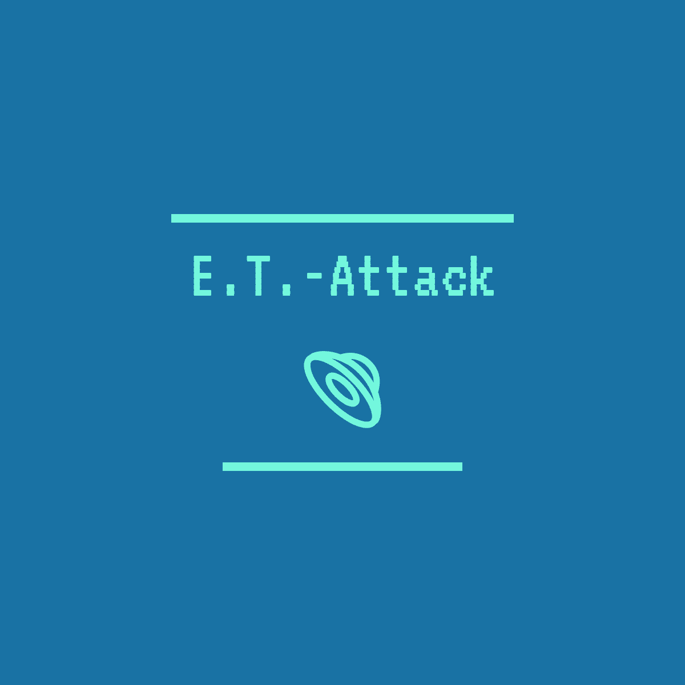

*****


*****



## Project Description

A space shooter game - inspired by the legendary game `Space Invaders`.

## Requirements

To run the main python module `et_attack.py`, you need to install the following package:  
- `pygame`

The installation method depends on the environment/ package manager you are using. The following examples show the installation of `pygame` for a standard python environment with pip and for an Anaconda environment via conda.

```python
pip install pygame
```

```python
conda install -c cogsci pygame
```

## License

This code is licensed under ``GPL-3.0 License``.

## Usage

To play `E.T.-Attack`, navigate to the installation folder of the required module (`et_attack.py`) and start a python shell running the code by typing ```python et_attack.py```.

The player is in control of the space ship at the bottom of the screen. This ship is able to navigate in two directions - right and left :left_right_arrow:. At the beginning of the game, a fleet of extraterrestrial UFOs is spawned on the screen, slowly ping-ponging towards the player's ship. The player's goal is to prevent any of the UFOs from either making it to the bottom of the screen or colliding with his own ship.  

|  | 
|:--:| 
| **Opening screen** |

To destroy the enemy's UFOs, the player can shoot bullets from the top of his ship. If a bullet hits a UFO, the UFO disappears, decimating the enemy fleet. However, there are only three bullets allowed at the same time on the screen, preventing the player from storm firing.  

  |  
:-------------------------:|:-------------------------:
**Player shooting bullet**             |  **Bullet hits UFO**
  |  
**UFO disappearing**             |  **Bullet number limit**

If the player has managed to destroy all of the enemy's UFOs, a new fleet is spawned to keep the game running and the player enters a higher level. Each destroyed UFO increases the player's score. The higher the level, the more points a player gets for destroying enemies but enemy speed, ship speed and bullet speed also increase, thereby making the game more difficult.  
The player has only a limited number of lives. As long as the player has remaining lives, the game goes on. If the last live is lost, it's `Game Over`.

|  | 
|:--:| 
| **Player has only two remaining lives** |

## Screen

In the upper right corner, two numbers indicate the current player's score and the level he's in. The upper centered number displays the high score of this player in that game. The remaining lives are indicated by a corresponding number of ship symbols in the upper left corner.  
When starting the game, the button in the middle of the screen must be clicked on to begin the game. The button returns if the player has lost all his lives and enables him to restart the game by clicking on the button again.

## Controls

Use the <kbd>&#8594;</kbd> and <kbd>&#8592;</kbd> arrow keys on your keyboard to navigate your ship in the wanted direction.
To shoot bullets from the top of your ship, press <kbd>Space</kbd>.  
To pause the game at any time, press <kbd>P</kbd>. To continue, press <kbd>P</kbd> again.  
To get a short break of 5 seconds, press <kbd>B</kbd>.  
To quit the game at any time, press <kbd>Q</kbd>. Don't worry, your high score will be saved.  
To edit or set back the high score, enter the `high_score.txt` and alter the integer value.  
To mute the game, press <kbd>M</kbd>. Press <kbd>M</kbd> again to hear all sound effects.  
Press <kbd>H</kbd> if you forgot controls or short cuts. A pdf file will open and the game stops automatically. Press <kbd>P</kbd> to resume.

## Hardware & Software Requirements

These programs can be run without much computing power. They can be executed on any modern device fullfilling minimal RAM/ CPU standards.

## History

Arcade games were simple games often run on coin-operated entertainment machines in bars or hotels like `Space Invaders`, `Pac-Man` or `Donkey Kong`. While originally being developted in the 1970s and 1980s, arcade games experienced a renaissance in the late '90s, building a myth and fascination among fans that still lives today.
